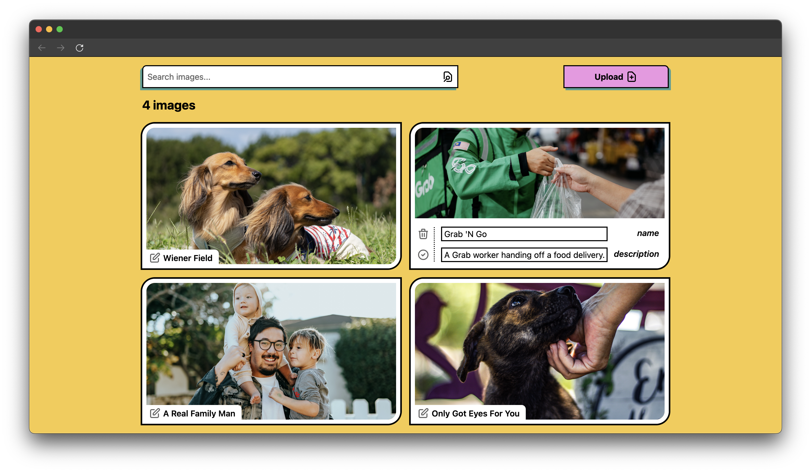

# next-crud-demo

A neubrutalist image uploading and retrieval app, built with Next.js and [uploadthing](https://uploadthing.com/).



## About

I was given a simple mock-up of this app and 48 hours to implement it (with mock API calls for image uploading/retrieving).

I spent about 8-12 hours working on this. I used the [T3 stack](https://create.t3.gg/) to quickly bootstrap a Next.js app and started mocking the front-end, then built a rudimentary back-end with [uploadthing](https://uploadthing.com/) using its documentation.

### Tech Stack

- [React](https://react.dev/)
- [Next.js](https://nextjs.org/)
- [TypeScript](https://www.typescriptlang.org/)
- [TailwindCSS](https://tailwindcss.com/)
- [tRPC](https://trpc.io/)
- [zod](https://zod.dev/)
- [uploadthing](https://uploadthing.com/)

## The Good, The Bad, and The Wants

### The Good

Things that went well:

- I'm really pleased with the neubrutalist design I came up with. I'd been wanting to try the style out for a while, so I shamelessly stole some colors from [Gumroad](https://gumroad.com/) and had fun designing.
- I got uploading to work! Pretty good given the time constraints :)
- The app is fairly responsive.
- The code is well-structured. Using Josh W. Comeau's [component file structure](https://www.joshwcomeau.com/react/file-structure/) helps.

### The Bad

Things that could've been better:

- No tests for the server.
- Didn't get the chance to test the design on desktop (only on my laptop).
- Not the most accessible (images don't have alt tags, for example).
- The upload button doesn't communicate the upload status very well - it could be hanging and the user wouldn't know.
- Error handling (or the current lack thereof).
- Certain stylings weren't made reusable, despite their repetition.
- More usage of server components.

### The Wants

Things I wish I could've added, given the time:

- Image metadata. I designed the app around being able to store / edit an image's name and description, but it turns out `uploadthing` doesn't support retrieving metadata.
  - I also wanted to store an image's size in the metadata, which would've allowed me to use Next's [`Image`](https://nextjs.org/docs/pages/api-reference/components/image) component and fix a UI bug.
- Related: user IDs. I planned to store a generic user ID in local storage and a given image's metadata, then only retrieve images with the corresponding ID. This would've had a simple way to change the current ID as well.
- The ability to refresh the image list, without waiting for the server query to refresh.
- The ability to delete images (and perhaps a "delete all" button).
- A custom font could've been cool with the neubrutalism.
- [boops](https://www.joshwcomeau.com/react/boop/) :(

## Developing

To simply run the app:

```sh
npm install
npm run build
npm run start
```

For developing, use `npm run dev` for the development server and `npm run format` for formatting and linting via [`dprint`](https://dprint.dev/) / [`xo`](https://github.com/xojs/xo).
